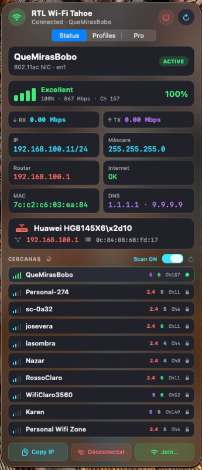

# RTL Wi-Fi Tahoe

Menu bar client for **Realtek USB Wi-Fi** on macOS. Talks to the `RtWlanU` kernel extension through its IOKit UserClient — no dependency on the classic StatusBarApp for daily scan and join.

<p align="center">
  
</p>

---

## Overview

| | |
|---|---|
| **Version** | 1.1.0 (build 7) |
| **Platform** | macOS 13+ |
| **UI** | Menu bar accessory (`LSUIElement`), SwiftUI popover |
| **Driver** | `RtWlanU` (third-party USB stack; kext must be loaded) |
| **Security** | Open, WEP, WPA-PSK, WPA2-PSK, **WPA3-SAE** |
| **Author** | [DrogaBox](https://github.com/DrogaBox) |

---

## Features

**Status panel**
- Live SSID, IPv4, netmask, gateway, DNS, internet reachability
- Signal quality (0–100%), link rate (Mbps), channel, Wi‑Fi generation (4/5/6/7)
- Router identification (OUI + HTTP fingerprint)
- Nearby network scan with band (2.4 / 5 GHz) and generation badges
- Band-preference selector to force 2.4 or 5 GHz on connect

**Join panel**
- Network list sorted by signal strength
- Security auto-detection from scan (Open / WPA2 / WPA3 / WEP / WPA)
- Manual authentication override (WPA-None for ad-hoc)
- WPS Push-Button mode (hardware PBC polling + open join fallback)
- WPS PIN entry (experimental)
- Network type: Infrastructure, Ad-hoc, Auto

**Profiles**
- Saved Realtek profiles (`ProfilesList.plist`)
- Forget network (clears password + profile1x.rtl + last network)
- Automatic reconnection after link loss or wake

**DNS**
- Presets: DHCP, Cloudflare, Google, Quad9, AdGuard, OpenDNS
- Custom DNS servers
- Automatic DNS application via System Configuration

**About Panel**
- App version and build number
- Detected driver version
- GitHub repository link
- Top 5 contributors with avatars and commit counts
- Certificate expiry inspection for Enterprise 802.1X

**Settings**
- 6 UI themes: Power Gadget, Tahoe Cyan, Midnight, Ember, Matrix, Rose
- Auto-reconnect toggle
- Nearby scan toggle (save radio/CPU)
- Launch at login
- Quit classic StatusBarApp on launch
- System notifications on connect / disconnect

**Security**
| Auth type | Raw value | Notes |
|-----------|-----------|-------|
| Open | 0 | No password |
| WEP 64 | 1 | 5‑character key |
| WEP 128 | 2 | 13‑character key |
| WPA-PSK | 3 | TKIP / mixed |
| WPA-PSK AES | 4 | |
| WPA2-PSK TKIP | 5 | |
| WPA2-PSK AES | 6 | Most common home AP |
| WPA3-SAE | 8 | Via `wpa_supplicant` |

**Localization**
- English (source) + Spanish
- Crowdin-ready (`crowdin.yml`, `Resources/*.lproj`)

> [!NOTE]
> Enterprise 802.1X (EAP‑TLS / PEAP / TTLS) is **not** implemented.
> Full WPS WSC handshake (M1–M8) is **not** implemented; PBC mode polls the hardware flag and falls back to an open join.

---

## Requirements

1. macOS 13 or later
2. Realtek USB Wi-Fi adapter with **`RtWlanU.kext` loaded**
3. No need for StatusBarApp as a login item for normal use
4. WPA3-SAE requires the bundled `wpa_supplicant` from StatusBarApp

---

## Build

```bash
# Development (incremental, debug)
make

# Release (optimized)
make release

# Full clean + release
make clean && make release

# Install to Desktop
cp -R build/RTLWifiTahoe.app ~/Desktop/

# Run tests
make test
```

The build script produces an ad-hoc signed app bundle under `build/`.

---

## Project layout

```
Sources/            SwiftUI app + RealtekDriver UserClient
  AppMain.swift         App delegate, menu bar, popover
  WiFiModel.swift       State machine, refresh loop, networking
  RealtekDriver.swift   IOKit UserClient OID communication
  JoinPanel.swift       Network list and password form
  PopoverView.swift     Main popover container
  StatusTab.swift       Live status display
  ProfilesTab.swift     Saved network profiles
  SettingsTab.swift     Preferences and theme picker
  DNSSectionView.swift  DNS preset selector
  AboutPanelView.swift  About window
  OIDConstants.swift    All driver OID constants
  NetworkScan.swift     Scan result parsing
  RealtekDriverProtocol.swift / MockRealtekDriver.swift  Test doubles
Resources/         AppIcon, en.lproj / es.lproj, sound
re/                OID map, reverse‑engineering notes, decompiled output
  OID_MAP.md            Complete OID table and connect protocol
  WIRELESS_ASSOCIATE_PROTOCOL.md  Full OID sequence documentation
  bn_gui_output/        Decompiled StatusBarApp functions
scripts/           Build helpers
Tests/             XCTest unit tests (WiFiModel, EnterpriseCertStore)
Makefile           Build system (dev / release / test / clean)
crowdin.yml        Localization pipeline
```

---

## Reverse engineering

Complete OID reference, connect protocol, and decompiled driver functions are in the [`re/`](re/) directory.

| Document | Contents |
|----------|----------|
| [OID_MAP.md](re/OID_MAP.md) | UserClient selectors, all discovered OIDs, NET_INFO layout, key function addresses |
| [WIRELESS_ASSOCIATE_PROTOCOL.md](re/WIRELESS_ASSOCIATE_PROTOCOL.md) | Full OID sequence for joining a network |
| [bn_gui_output/](re/bn_gui_output/) | Decompiled output of all documented driver functions |

The app implementation derived from this RE lives in:
- [`Sources/OIDConstants.swift`](Sources/OIDConstants.swift) — all OIDs as typed Swift constants
- [`Sources/RealtekDriver.swift`](Sources/RealtekDriver.swift) — OID query/set, connect, scan, radio, WPS, NET_INFO parser

---

## Privacy

Passwords are stored in the system Keychain and Realtek's profile store. They are never shown in the UI.

---

## License

MIT — see [LICENSE](LICENSE).

---

## Disclaimer

This project interfaces with a third-party kernel extension. Use at your own risk. It is not affiliated with Realtek Semiconductor Corp. or Apple Inc.

---

## Links

| | |
|---|---|
| **Repository** | https://github.com/DrogaBox/RTLWifiTahoe |
| **Releases** | https://github.com/DrogaBox/RTLWifiTahoe/releases |
| **Donate (PayPal)** | https://www.paypal.com/donate/?business=mrleisures@gmail.com |
